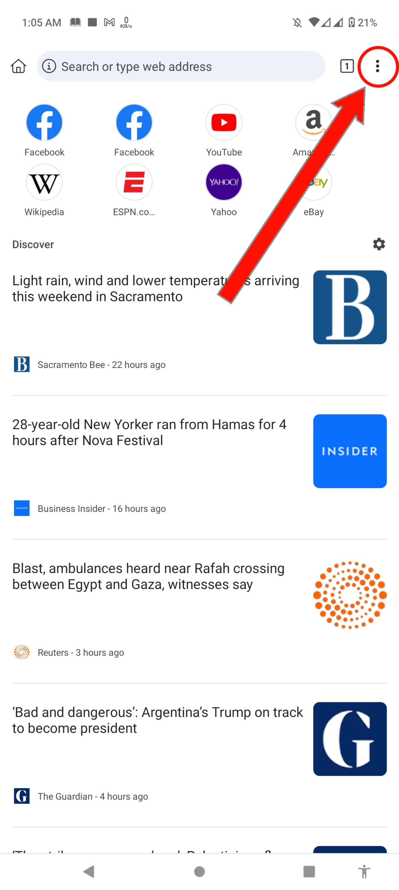

<!--- This Extension Script Copy Froam a Indonesian Progrommer. And I'm translated Indonesian language to English -->

 <h1>How To Use </h1> 

# Step 1

At frist you need a browser who support <a href="https://chrome.google.com/webstore/category/extensions">Google Chrome Extensions.</a> I'm using <a href="https://play.google.com/store/apps/details?id=com.kiwibrowser.browser">Kiwi Browser.</a> Your can use <a href="https://play.google.com/store/apps/details?id=com.yandex.browser">Yandex Browser</a>,<a href="https://play.google.com/store/apps/details?id=net.maskbrowser.browser">Mask Browser</a>,<a href="https://play.google.com/store/apps/details?id=com.lemurbrowser.exts">Lemur Browser</a>,<a href="https://play.google.com/store/apps/details?id=org.flow.browser">Flow Browser</a> or any browser who support  <a href="https://chrome.google.com/webstore/category/extensions">Google Chrome Extensions.</a> 

# Step 2

Open Browser and go <a href="https://facebook.com">https://facebook.com</a> and login your facebook account.

# Step 3

Then Click 3 dots in the right side in top

  

Then Click Extensions

  

Then Enable Developer Mode. If already enabled ignore it.

  

Then Click <b>+form.zip/.crx/user.js</b>

<b>Add <a href="#how-to-download-zip">Zip</a> File.<a href="#how-to-download-zip">Zip</a> file download link provided <a href="#how-to-download-zip">here.</a> </b>

# Step 4

<b>Again Click 3 dots in the right side in top</b>

  

Then Click <b>Change Facebook Account Name Before 60 Days</b>

  

Then Enter Your New First and Last name. Then Click Change Name   <b>Note: <i>You Can use Emoji and Black Verification Symbol(󱢏) in your Name.</i></b>

 <h1>How To Donwload Zip</h1> 

